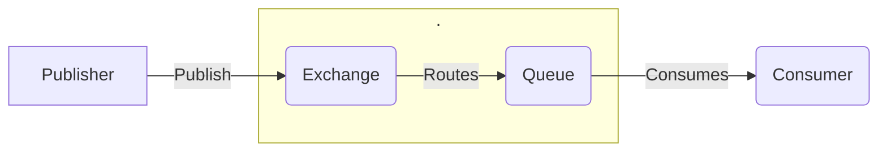
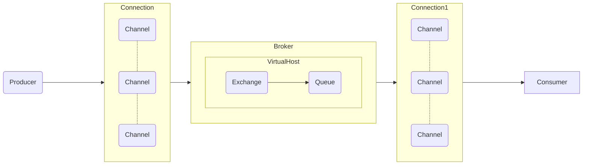

**AMQP**(Advanced Message Queuing Protocol)即高级消息队列协议。它是一种网络协议，旨在提供跨异构系统之间可靠、高效的消息传递机制。AMQP 的设计目标是实现高级的消息传递特性，包括灵活的路由、消息持久性、事务支持、安全性等，以支持复杂的消息传递场景.[AMQP协议官网](https://www.amqp.org/)

## AMQP的产生

在 AMQP 出现之前，存在其他消息队列协议和系统。AMQP 的发展是为了**解决分布式系统中异步通信和消息传递**的一些挑战，但之前已经有一些尝试通过消息队列来实现异步通信的方案。

以下是一些在 AMQP 之前出现的消息队列协议和系统：

1. **Java Message Service (JMS):**
   - JMS 是 Java 平台上定义的一种消息中间件 API 规范，它提供了一种标准的方式让 Java 应用程序之间进行异步通信。JMS 并不是一种协议，而是一种 API 规范，因此具体的实现可以有多种，如 Apache ActiveMQ 和 IBM MQ 等。
2. **Message Queue Interface (MQI):**
   - MQI 是 IBM 提供的消息队列接口规范，用于实现异步通信。它被用于 IBM MQ 系列产品，允许不同平台和编程语言的应用程序之间进行消息传递。
3. **Microsoft Message Queuing (MSMQ):**
   - MSMQ 是 Microsoft 提供的消息队列系统，用于在 Windows 环境下实现异步通信。它允许应用程序在同一台计算机或通过网络进行消息传递。

这些系统和协议在其时间内都发挥了重要的作用，但它们通常是特定于平台或特定于厂商的解决方案。AMQP 的出现旨在提供一个更通用、开放的标准，使得不同厂商和不同平台的消息中间件能够实现互操作性。因此，AMQP 成为一个开放的、跨平台的标准，为分布式系统提供了更灵活、可扩展的消息传递机制。

对比之前出现的消息队列,AMQP协议的优势在于:

1. **跨平台和跨语言：**
   - AMQP 是一个开放的、跨平台的协议，允许不同平台和不同编程语言的应用程序之间进行消息传递。这使得它成为在异构系统中实现分布式通信的理想选择。
2. **标准化协议：**
   - AMQP 是一个开放标准的消息传递协议，由于其标准化的特性，不同厂商和组织可以选择实现符合 AMQP 规范的消息中间件。这种标准化提供了互操作性和灵活性。
3. **异步通信和解耦：**
   - AMQP 支持异步通信模型，生产者可以异步地将消息发送到队列，而消费者可以异步地从队列中接收和处理消息。这种解耦的方式使得系统的各个部分能够独立演化。
4. **灵活的消息模型：**
   - AMQP 提供了灵活的消息模型，包括不同类型的交换机、队列和路由规则。这使得可以根据具体的业务需求定义复杂的消息传递模式。
5. **持久性和可靠性：**
   - AMQP 支持消息和队列的持久性，确保消息在消息代理重启后仍然可用。这对于构建可靠的分布式系统是至关重要的。
6. **事务和确认机制：**
   - AMQP 提供了事务机制，允许将一系列消息操作封装在一个事务中，以保证它们的原子性。确认机制确保消息在被消费者成功处理后得到确认。

## 整体架构

AMQP 本身并没有规定具体的实现，而是提供了一组通用的规范，因此具体的 AMQP 架构会因实现而异。一般来说，AMQP 的整体架构包括以下几个关键组件:

* **消息代理（Message Broker）**
  * 消息代理是整个 AMQP 系统的核心组件，负责接收、存储、路由和传递消息。消息代理通常包括一个或多个交换机、队列和路由规则，用于管理消息的传递。
* **生产者（Producer）**
  * 生产者是消息的创建者，负责产生消息并将其发送到消息代理。生产者创建消息，并通过 AMQP 协议将消息发送到指定的交换机。
* **交换机（Exchange）**
  * 交换机是消息代理中的一个组件，负责接收从生产者发送过来的消息，并将其路由到一个或多个队列。交换机根据不同的路由策略，将消息路由到与之绑定的队列。
* **队列（Queue）**
  * 队列是消息的存储位置，消息代理将消息存储在队列中，等待消费者来获取并处理。队列通常与交换机进行绑定，接收特定类型的消息。
  * 队列分为持久化消息队列和临时消息队列
* **消费者（Consumer）**
  * 消费者是消息的接收者，负责从队列中获取消息并进行处理。消费者通过 AMQP 协议连接到消息代理，订阅特定的队列以接收消息。
* **虚拟主机（Virtual Host）**
  * 虚拟主机是 AMQP 中的逻辑隔离单元，它提供了一个隔离的环境，允许在同一个消息代理上运行多个相互独立的消息通信系统。
* **通道（Channel）**
  * C hannel是建立在Connection连接之上的一种轻量级的连接。几乎所有的操作都在Channel中进行，Channel是进行消息读写的通道，客户端可以建立对各Channel，每个Channel代表一个会话任务。
  * 通道是 AMQP 连接中的一个逻辑通信路径，用于在客户端和消息代理之间进行消息的传递。一个 AMQP 连接可以包含多个通道，每个通道可以独立地执行消息的生产和消费操作。
  

**整体架构图**

**核心组成**

> Connection连接,应用程序与Broker的网络连接TCP/IP/三次握手和四次挥手.
>
> AMQP连接通常是长连接。AMQP是一个使用 TCP提供可靠投递的应用层协议。AMQP 使用认证机制并且提供 TLS（SSL）保护

## 使用AMQP的服务和中间件

* **RabbitMQ:**
  - RabbitMQ 是一个流行的开源消息中间件，完全支持 AMQP 协议。它提供了高度灵活的消息传递机制，支持多种消息模型和路由规则。

* **Apache Qpid:**
  - Apache Qpid 是 Apache 软件基金会的项目之一，提供了一种实现 AMQP 协议的消息中间件。它支持多种编程语言和平台。

* **ActiveMQ:**
  - Apache ActiveMQ 是另一个 Apache 项目，它是一个开源的消息中间件，支持 AMQP 协议以及其他消息协议。它具有高性能、可扩展性和灵活性。

* **Azure Service Bus:**
  - Azure Service Bus 是微软 Azure 云平台提供的消息中间件服务，支持 AMQP 协议。它用于在分布式应用程序中实现异步通信。

* **Apache Kafka:**
  - 尽管 Apache Kafka 主要采用自家的协议，但它也支持 AMQP 协议。Kafka 是一个分布式事件流平台，用于处理和存储大规模的事件数据。

* **Red Hat AMQ:**
  - Red Hat AMQ 是 Red Hat 提供的消息中间件解决方案，支持 AMQP 协议。它是一个企业级的消息传递平台。

> 中间件和服务的区别: 中间件是一种通用的基础设施层，用于支持系统中的各种应用和服务之间的通信和协作,用于**串联多个服务**.而服务则更关注业务功能的提供.

## Kombu

[Kombu](https://github.com/celery/kombu) 是一个用于处理消息传递（Message Queueing）的 Python 库, 实现了AMQP协议.它提供了一个通用的消息传递 API，允许在不同的消息代理（例如 RabbitMQ、Redis、Amazon SQS 等）之间进行切换。

**Kombu 是 Celery 任务队列库的底层消息传递层**，它使得 Celery 可以与多种消息代理进行交互.

**特性:**

1. **多协议支持：** Kombu 支持多种消息代理的协议，包括 AMQP、Redis、Amazon SQS、ZeroMQ 等。
2. **生产者-消费者模型：** Kombu 提供了生产者-消费者模型，允许应用程序发布和接收消息。
3. **可扩展性：** Kombu 提供了灵活的插件系统，允许用户扩展和自定义消息代理的适配器。
4. **消息序列化：** Kombu 支持多种消息序列化格式，包括 JSON、MessagePack、pickle 等。
5. **持久性：** Kombu 允许消息持久性，确保消息在代理故障或重启后不会丢失。

Kombu 的灵活性使得它成为构建分布式系统、任务队列、事件驱动系统等应用的有力工具。在 Celery 中，Kombu 负责处理消息的发送和接收，以及与消息代理的通信.

