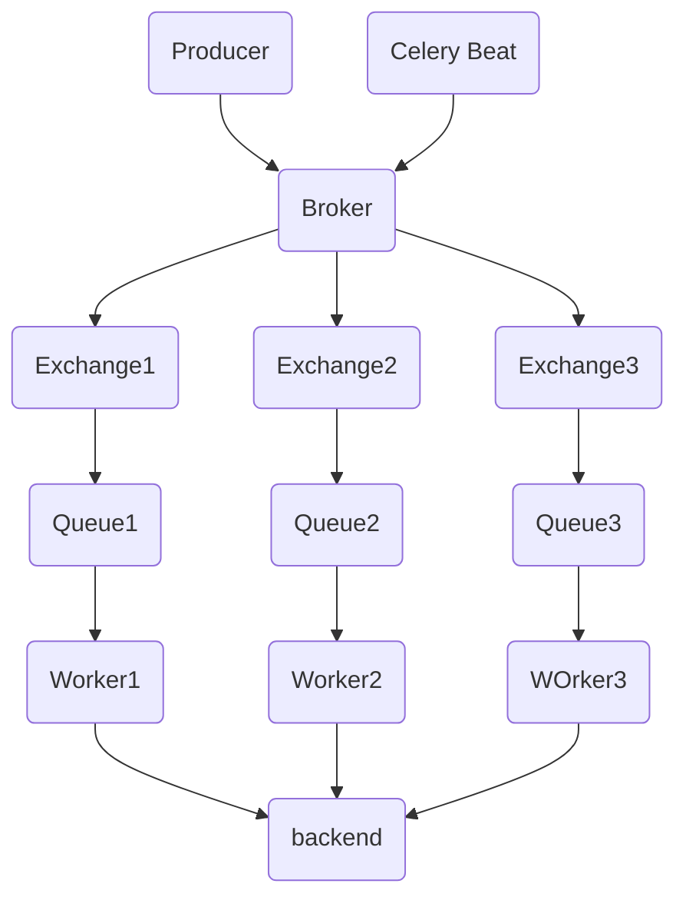

# Celery的定义
Celery 是一个用于处理**分布式**任务队列的开源**分布式任务队列系统**。它允许你将任务异步地分发到多个工作者（workers），并支持在分布式环境中进行任务的执行和管理.Celery是用Python编写的，但该协议可以在任何语言实现。它也可以与其他语言通过webhooks实现.

Celery底层依赖 Kombu，基于 Kombu 完成基本功能

**特点:**

1. **异步任务处理：** Celery 允许你将任务提交到队列中，然后异步地由工作者执行。这样，你的应用程序可以继续处理其他任务而不必等待长时间运行的任务完成。
2. **分布式架构：** Celery 支持将任务分发到多个工作者，这些工作者可以在不同的机器上运行。这使得 Celery 适用于大规模和分布式的应用程序。
3. **定时任务：** Celery 支持定时任务的调度和执行。你可以在特定的时间点或按照设定的间隔执行任务。
4. **任务优先级：** 你可以为任务设置不同的优先级，以确保高优先级的任务被优先处理。
5. **任务结果存储：** Celery 允许你获取异步任务的执行结果，以便进一步处理。
6. **多种并发模式选择:** 可选多进程、Eventlet 和 Gevent 三种模式并发执行.
7. **支持多种消息代理：** Celery 可以与多种消息代理（如 RabbitMQ、Redis、Amazon SQS 等）集成，以便灵活适应不同的环境和需求。
8. **灵活的任务路由：** 通过配置路由规则，你可以将不同类型的任务分发到不同的队列中，以满足任务的不同需求。
9. **容易扩展：** Celery 的架构允许你轻松地添加更多的工作者，以处理更多的任务负载。

# 消息队列和任务队列的区别

消息队列和任务队列，最大的不同之处就在于理念的不同 -- **消息队列传递的是“消息”，任务队列传递的是“任务”**。

- 消息队列用来快速消费队列中的消息。消息队列更侧重于**消息的吞吐、处理，具有有处理海量信息的能力**。另外利用消息队列的生长者和消费者的概念，也可以实现任务队列的功能，但是还需要进行额外的开发。
- 任务队列是**用来执行一个耗时任务。任务队列则提供了执行任务所需的功能，比如任务的重试，结果的返回，任务状态记录**等。虽然也有并发的处理能力，但一般不适用于高吞吐量快速消费的场景。

# 组件

## Celery Beat 任务调度器

任务调度器,Beat进程会读取配置文件的内容,周期性的将配置中到期需要执行的任务发送给任务队列.

## Celery Worker 消费者

执行任务的消费者.

## Broker 消息代理(消息中间件)

消息中间件,Celery本身没有实现消息中间件,需要使用三方实现(Redis/rabbitmq),用于接收生产者发送来的任务,存入队列再按照配置发送给消费者.

## Producer 生成者

调用了Celery提供的API,函数或者装饰器而产生任务的都是生成者

## Result Backend 任务结果

任务处理完后保存状态和结果,以供查询.Celery默认已支持Redis,RabbitMQ,MongoDB,Django ORM,SQLAlchemy等方式.

# 架构图

